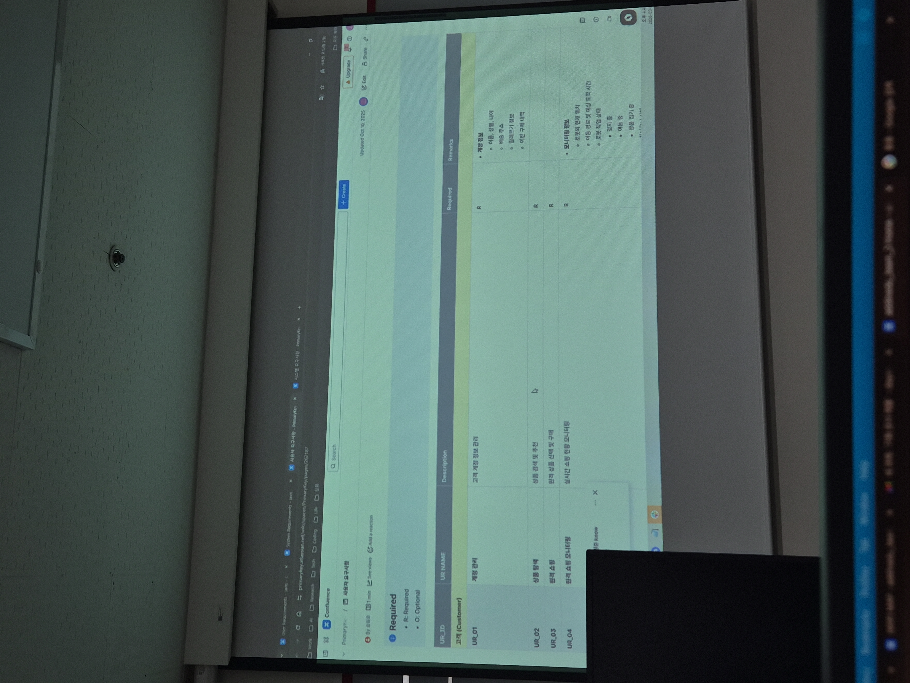

ur requirements 

- UR 예시 1 의 template 을 따르고, descriptions 은 동사형으로 적는다. 
- 사용자 카테고리: 고객, 직원, 관리자 등 

<UR> 예시 1 
* ur_name : 제목 
* required: 필수 요소/선택적 (R/O) -> 필수사항부터 개발 
  * required / Optional 
* 소제목으로 나눠줘도 좋다. (고객, )

| UR_ID | UR_Name | Description | required | remarks |
|고객 (Customer) | | | | |
| ur_01 | 계정 관리 | 고객 계정 정보 관리 | R | 계정 정보 (이름, 성별, 나이, 배송 주소, 알레르기 정보, 이전 구매 내역) | 
| UR_02 | 상품 탐색 | 상품 검색 및 추천 | R | | 
| UR_03 | 원격 쇼핑 | 원격 상품 선택 및 구매 | R | |
... 
| 관리자 | 
| UR_07 | 주문 정보 관리 | ~ | R | * 주문 정보, 주문 ID, 고객 ID, 주문 상품 목록, 주문 상태 | 
... 

<UR> 예시 2 
|UR_ID | Functions | Priority | 역할 |
| UR_01 | ~제공해야한다. | 1 | AMR 이동 및 로봇 팔 픽업| 

* 명사로 안 끝나게 해도 된다. 조사를 섞어서 동사로 끝내야 나중에 볼때 이해가 빠름. 

<system requirements>

즉, 특정 UR ID에서 Sr로 파생된 것이 많음. 
- 사람이 왔을 때 인사한다 (Ur)
- (sr)로 변환 예시 
  - > 사람인지를 인지해야하는 기능 (condition -> action)
  - > 사람으로 확인이 되었을 때, 인사를 하는 기능 
  - > 사람이 단골인지를 판단 -> db를 확인한다. (방문횟수) -> 인사를 한다. 이런 식으로 사람의 타입이 중요하면 기능 분리 가능 
- 즉, condition -> action 으로 작성한다. 

**** 주의점 
- 로봇이 인사를 한다. 라고 했지 무슨 롭소이 인사를 한다 등의 설계를 하면 안됨 
- 냉장고 설명서 처럼 작성해야한다. 
- 냉각 시스템이 프레온 가스가 어떻고 원리가 전혀 들어가지 않음 
  - 무슨 버튼 누르면 -> 조절 할 수 있다. 
  - (안좋은 예시) 카메라로 yolo 인식 x 
  - (좋은 예시) 로봇이 사람을 인식한다. 

Required 
* R1 : critical (핵심 기능)
* R2: High(주요 기능)
* R3: Medium (보조 기능)
* R4: Low (부가 기능)
* O: Optional

|SR_ID| SR_NAME | Description | Priority | Remark | 
| UR_01: 계정 관리 | | | | | 
| SR_01| 로그인 | 고객 및 관리자가 로그인하는 기능 | R1 | * 세부 기능, ID/비밀번호 인증 | 
| SR_02 | 고객 정보 조회 | 고객 및 관리자가 곡객의 정보를 조회하는 기능 | O | 조회 가능 정보 (이름, 성별, 나이, 알레르기 정보, 비건 우유, 이전 구매 내역)|
| UR_02 : 상품 탐색 | ... 

* 표에 들어가야 하는 요소들은 양식을 뽑아 주겠다. 
* ur과 sr은 시간의 흐름으로 row를 작성 